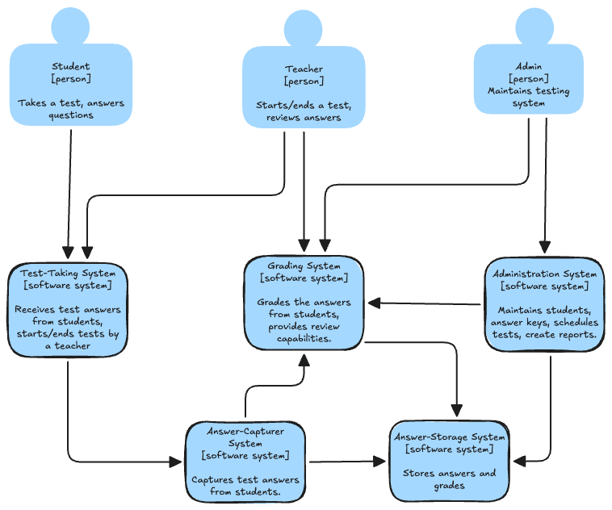
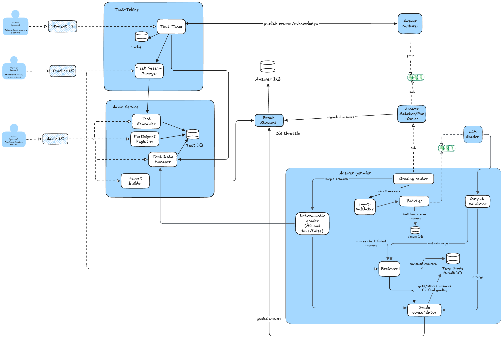
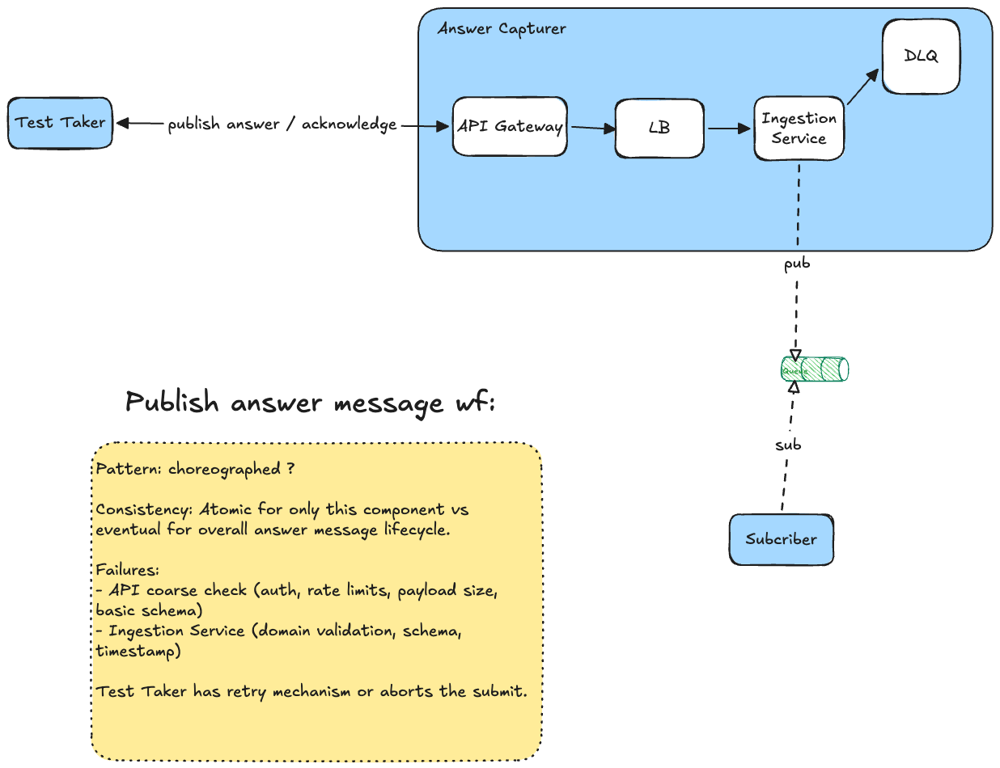

# Make the Grade

## Architectural Characteristics

See [Architectural Characteristics](architectural-characteristics.md).

## Architecture Style

See [Architecture Style ADR](architecture-style-adr.md).

## Architecture

### System Context Diagram C1
By applying the C4 approach to visualize our software architecture, we were able to clearly illustrate the dependencies between different components of our application and highlight their relationships.
We will primarily focus on the C2 views to provide an overarching overview.

[//]: # (See [System Context Diagram]&#40;c4-context.excalidraw.png&#41;)

### Container Diagram C2

### Answer Capturer Physical

## Failure scenarios
See [Failure Scenarios](failure-scenarios.md).